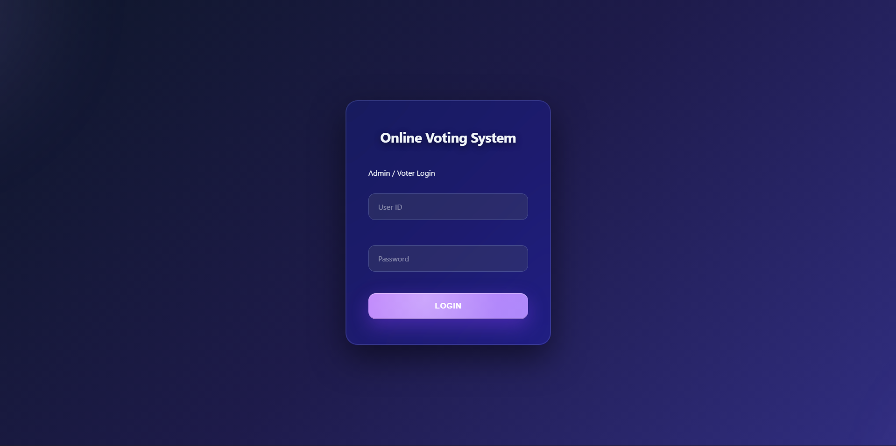
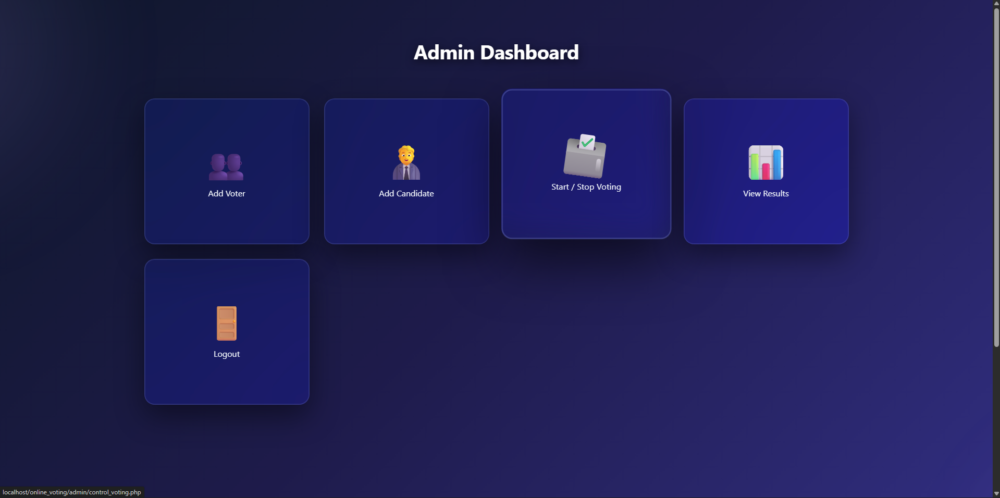
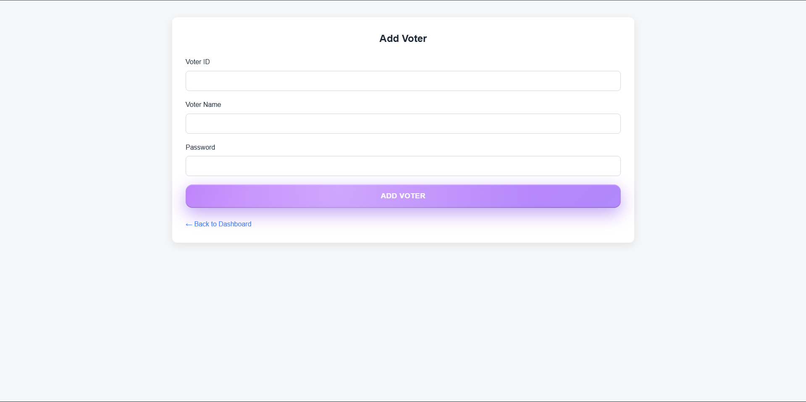
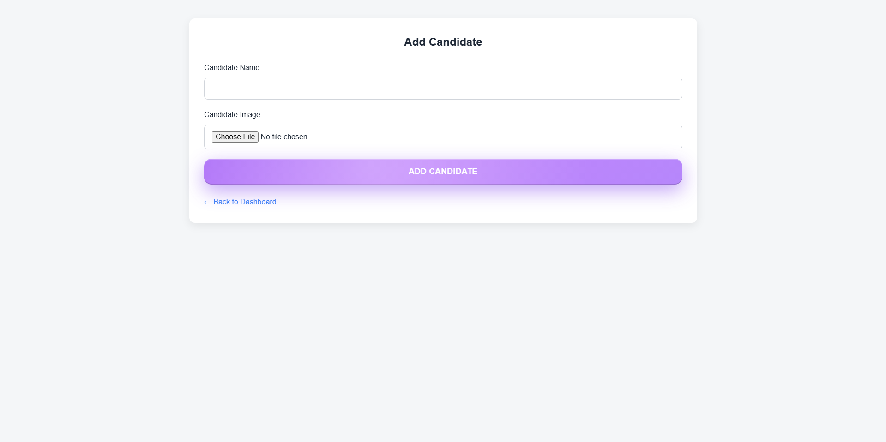
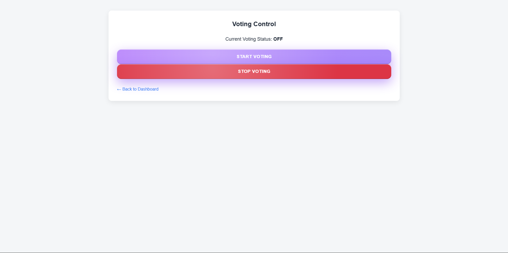
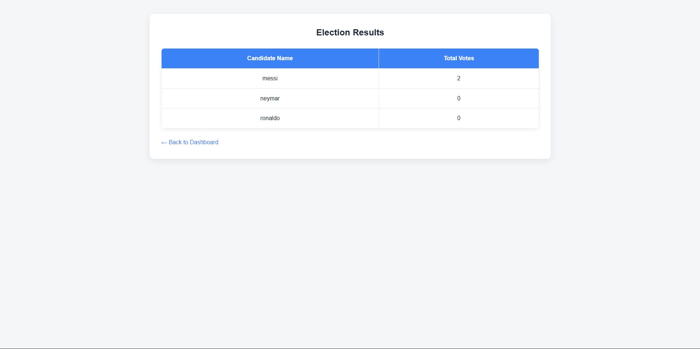
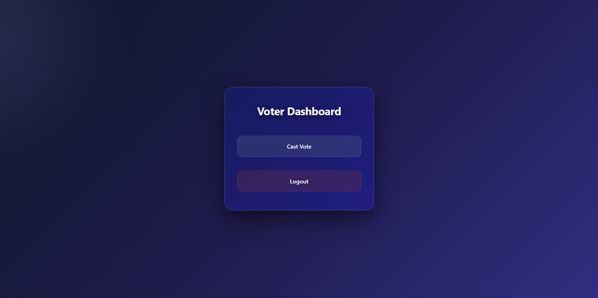
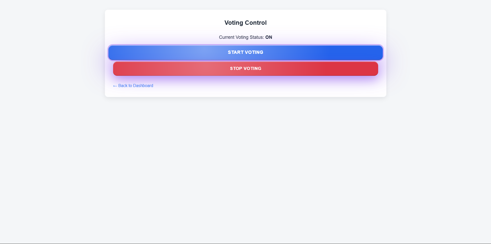
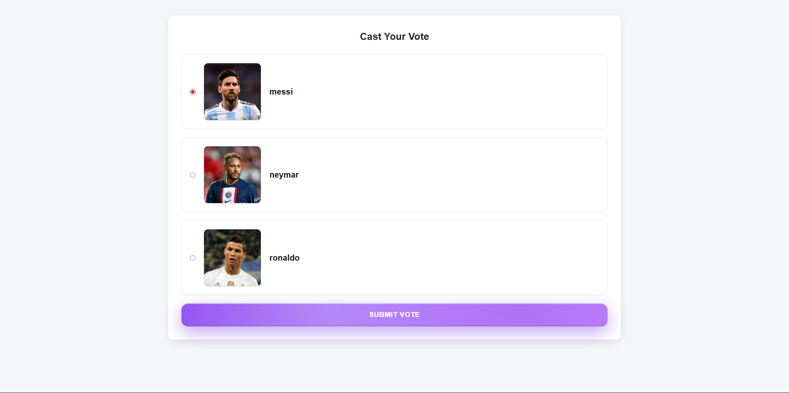

# Online Voting System using PHP and MySQL

## Project Description
The Online Voting System is a web-based application developed using PHP and MySQL to conduct elections electronically. It is designed mainly for academic and institutional purposes such as college elections and student council voting.

The system eliminates drawbacks of traditional voting like manual errors, high cost, and delayed results.

---

## Technologies Used
- HTML & CSS – Frontend design
- PHP – Backend logic
- MySQL – Database
- XAMPP – Local server (Apache & MySQL)
- VS Code – Code editor

---

## User Roles
### Admin
- Login securely
- Add voters
- Add candidates with images
- Start or stop voting
- View election results

### Voter
- Login using voter ID
- View candidates with images
- Cast vote only once
- Automatically logged out after voting

---

## Project Features
- Secure login system
- One voter – one vote rule
- Admin controlled voting
- Automatic result calculation
- Image-based candidate display
- Clean and professional UI

---

## Database Tables
- admin
- voters
- candidates
- votes
- settings

---

## Folder Structure
See project directory structure for organized separation of admin, voter, and assets.

---

## How to Run the Project
1. Install XAMPP
2. Start Apache and MySQL
3. Place project folder inside `htdocs`
4. Import database using phpMyAdmin
5. Open browser and go to:

---

## Future Enhancements
- Password encryption
- OTP-based login
- Online deployment
- Mobile application support

---

## Conclusion
This project demonstrates how web technologies can be used to create a secure and efficient electronic voting system suitable for real-world applications.

---

## 📸 Project Screenshots

### 🔐 Login Page

### 🧑‍💼 Admin Dashboard

### ➕ Add Voter

### ➕ Add Candidate

### 🗳️ Voting Control

### 📊 View Results

### 👤 Voter Dashboard

### 🗳️ Voting ON

### 🚫 Voting Closed

### 🗳️ Cast Vote

### ✅ Voting Completed

